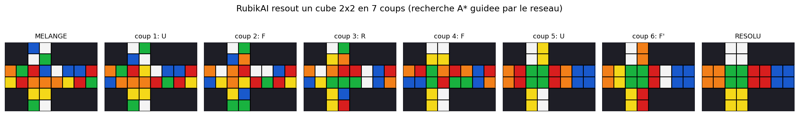
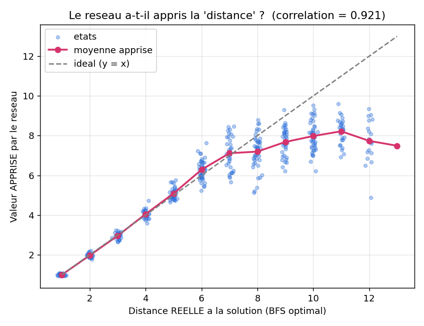
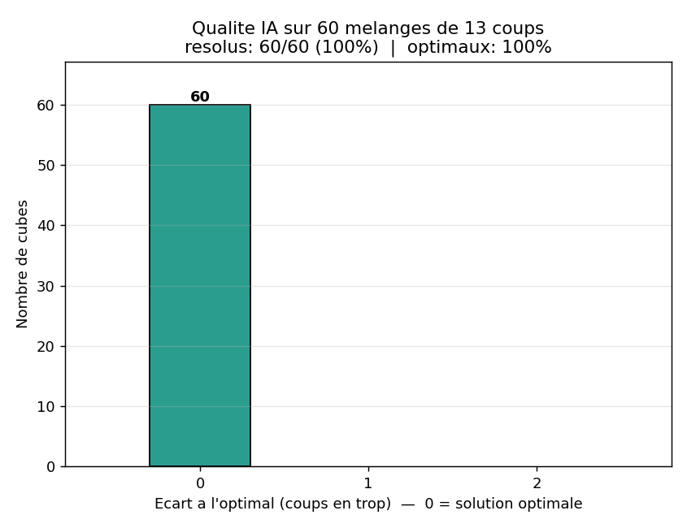
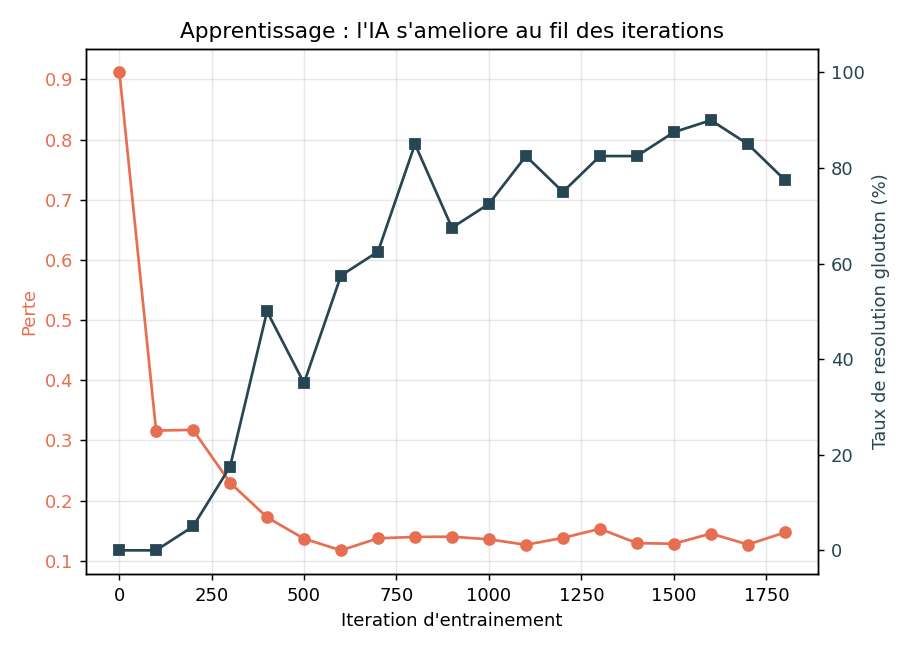

# 🧩🧠 RubikAI — Une IA qui apprend à résoudre le Rubik's Cube toute seule

> **En une phrase :** un programme apprend, tout seul et sans tricher, à résoudre le
> Rubik's Cube — un peu comme un enfant qui apprend en jouant, sauf qu'ici il joue
> des millions de parties en quelques minutes.



---

## 📖 Ce README est fait pour TOI

Tu as 15 ans ? Tu n'y connais rien en intelligence artificielle ? **Parfait.**
Ce document explique **tout** depuis le début, avec des images et des comparaisons de
la vie de tous les jours. Aucune connaissance requise. On va y aller doucement. 🙂

> 💡 Astuce : ne saute pas les analogies (les paragraphes « 🎯 Comme si… »). C'est elles
> qui font tout comprendre.

---

## 🗺️ Sommaire

1. [C'est quoi, ce projet ?](#1-cest-quoi-ce-projet)
2. [Les mots compliqués, expliqués simplement](#2-les-mots-compliqués-expliqués-simplement)
3. [Pourquoi résoudre un Rubik's Cube est SUPER dur](#3-pourquoi-résoudre-un-rubiks-cube-est-super-dur)
4. [L'idée géniale : on inverse le problème](#4-lidée-géniale--on-inverse-le-problème)
5. [Les 5 ingrédients du projet](#5-les-5-ingrédients-du-projet)
6. [Le code expliqué pas à pas (sans jargon)](#6-le-code-expliqué-pas-à-pas-sans-jargon)
7. [Les résultats, expliqués image par image](#7-les-résultats-expliqués-image-par-image)
8. [Essaie-le toi-même](#8-essaie-le-toi-même)
9. [La structure des fichiers](#9-la-structure-des-fichiers)
10. [Aller plus loin](#10-aller-plus-loin)
11. [Glossaire complet](#11-glossaire-complet)
12. [Sources & licence](#12-sources--licence)

---

## 1. C'est quoi, ce projet ?

Tu connais le **Rubik's Cube** : ce cube coloré qu'on mélange et qu'il faut remettre
avec une seule couleur par face. C'est galère, non ?

Ici, on a créé une **intelligence artificielle** (une « IA ») qui apprend à le résoudre
**toute seule**. Et le truc fou, c'est qu'**on ne lui montre JAMAIS comment faire**. On
ne lui donne aucune solution, aucun tutoriel. Elle découvre tout par elle-même.

C'est exactement la méthode utilisée par des chercheurs et publiée dans une grande revue
scientifique (*Nature*, en 2019). Ce projet en est une version simplifiée, faite pour
**comprendre** comment ça marche.

---

## 2. Les mots compliqués, expliqués simplement

Avant de continuer, voici les 5 mots qu'on va utiliser. Garde-les en tête :

| Mot savant | Traduction pour humain |
|---|---|
| **Algorithme** | Une recette de cuisine pour l'ordinateur : une suite d'étapes précises. |
| **Intelligence artificielle (IA)** | Un programme qui « apprend » à partir d'exemples, au lieu qu'on lui dise tout. |
| **Réseau de neurones** | Le « cerveau » de l'IA. Une grosse fonction mathématique inspirée du cerveau humain, qui s'améliore avec l'entraînement. |
| **Deep Learning** (apprentissage profond) | Quand ce cerveau a beaucoup de « couches » empilées. C'est ce qui le rend puissant. |
| **Apprentissage par renforcement** | Apprendre par essais-erreurs, comme un jeu vidéo où on gagne des points. |

🎯 **Comme si…** un réseau de neurones, c'est comme un élève au début nul, à qui on fait
passer des milliers de petits tests. À chaque erreur, il ajuste un peu sa façon de penser.
Au bout de milliers de tests, il devient excellent. Sauf que là, ça va très vite.

---

## 3. Pourquoi résoudre un Rubik's Cube est SUPER dur

Le problème, c'est le **nombre de positions possibles**.

- Un Rubik's Cube **2×2** (le « petit ») : environ **3,6 millions** de positions.
- Un Rubik's Cube **3×3** (le classique) : **43 252 003 274 489 856 000** positions.
  Oui, **43 trillions**. C'est plus que le nombre de grains de sable sur une grande plage.

🎯 **Comme si…** tu devais trouver UNE bille précise cachée quelque part sur Terre, en
ouvrant les yeux au hasard. Impossible de tout essayer. Il faut être **malin**, pas
juste rapide.

---

## 4. L'idée géniale : on inverse le problème

Voici l'astuce centrale du projet. Lis bien, c'est le cœur de tout. ❤️

Apprendre à résoudre un cube **mélangé** est très dur (on vient de voir pourquoi).
**Alors on fait l'inverse : on part de la solution.**

🎯 **L'analogie de la forêt et de la maison :**

> Imagine que tu es perdu dans une immense forêt et que tu veux rentrer chez toi.
>
> - **Méthode bête :** marcher au hasard en espérant tomber sur ta maison. 😱 (Ça peut
>   prendre des années.)
> - **Méthode maligne :** partir **DE ta maison** et planter des panneaux sur les arbres.
>   Sur les arbres juste à côté : « 1 pas ». Un peu plus loin : « 2 pas ». Encore plus
>   loin : « 3 pas »… Maintenant, **où que tu sois perdu**, il te suffit de toujours
>   marcher vers le panneau avec le **plus petit numéro**. Tu rentres forcément. 🏡

C'est **exactement** ce que fait RubikAI :

1. On part du **cube résolu** (= « la maison »).
2. On le mélange d'**1 coup**, puis de **2 coups**, de **3 coups**… (on s'éloigne de la maison).
3. Le réseau de neurones apprend à **deviner le numéro sur le panneau** : « ce cube est à
   environ X coups de la solution ».
4. Pour résoudre **n'importe quel** cube, on suit les numéros qui **descendent** jusqu'à 0.

Et le plus beau : la **seule** information qu'on donne à l'IA, c'est que le cube résolu
vaut **0**. Tout le reste, elle le déduit seule. C'est ça, l'apprentissage
**auto-supervisé** (le nom technique est *Autodidactic Iteration* = « itération autodidacte »).

---

## 5. Les 5 ingrédients du projet

Le projet est découpé en 5 fichiers, chacun avec un rôle simple :

| Fichier | Son rôle, en une phrase | Analogie |
|---|---|---|
| `cube.py` | Le cube virtuel : il connaît les couleurs et sait tourner les faces. | 🧩 Le jouet |
| `model.py` | Le cerveau (réseau de neurones) : il devine la distance à la solution. | 🧠 Le cerveau |
| `train.py` | L'école : il entraîne le cerveau, des milliers de fois. | 🏫 L'école |
| `solve.py` | Le solveur : il suit la boussole du cerveau pour résoudre. | 🧭 Le GPS |
| `solver_bfs.py` | L'arbitre : un solveur parfait qui sert à **noter** l'IA. | ⚖️ Le juge |

On va voir chacun en détail. 👇

---

## 6. Le code expliqué pas à pas (sans jargon)

Ici, on regarde les vrais morceaux de code, mais **traduits en français normal**.
Tu n'as pas besoin de savoir coder pour suivre.

### 🧩 6.1 — Comment représenter un cube dans l'ordinateur ?

Un ordinateur ne « voit » pas les couleurs. Alors on numérote :
chaque couleur devient un chiffre de **0 à 5** (0 = rouge, 1 = orange, 2 = blanc, etc.).

Un cube 2×2 a **24 autocollants** (6 faces × 4 stickers). On range donc les 24 chiffres
dans une **liste**. Voilà, un cube = une liste de 24 nombres. C'est tout !

🎯 **Comme si…** tu décrivais le cube à un ami au téléphone : « case 1 : rouge, case 2 :
bleu, case 3 : blanc… ».

### 🔄 6.2 — Comment tourner une face ?

Quand tu tournes une face, les autocollants **changent de place** selon un schéma
**toujours identique**. On calcule ce schéma une seule fois (on appelle ça une
« permutation »). Ensuite, tourner une face = réorganiser la liste selon ce schéma.

```python
def apply(self, name):
    self.colors = self.colors[self.perms[name]]
```

**Traduction ligne par ligne :**
- `self.colors` → la liste des couleurs actuelles du cube.
- `self.perms[name]` → la **recette de rebrassage** du coup `name` (par ex. « R »).
  Elle dit : « l'autocollant n°5 va à la place n°12, le n°12 va à la place n°3… ».
- La ligne entière → on réécrit la liste des couleurs dans le nouvel ordre. Voilà, la
  face est tournée. ⚡ Très rapide, et zéro risque d'erreur.

🎯 **Comme si…** tu battais un jeu de cartes en suivant **toujours** le même mouvement
précis des mains.

**Et on a VÉRIFIÉ que notre cube est correct.** Un vrai Rubik's Cube obéit à des lois
mathématiques. Par exemple : la séquence `(R U R' U')` (un grand classique des cubeurs),
répétée **exactement 6 fois**, ramène toujours le cube au départ. On l'a testé :

```python
def test_sexy_move_order6():
    c = Cube(3)
    for _ in range(6):                       # on répète 6 fois
        c.apply("R").apply("U").apply("R'").apply("U'")
    assert c.is_solved()                     # le cube DOIT être revenu résolu
```

**Traduction :** on applique 6 fois la séquence, puis on **exige** (`assert`) que le cube
soit résolu. Si ce n'était pas le cas, le programme planterait. ✅ Il ne plante pas →
notre cube virtuel se comporte comme un vrai.

### 🧠 6.3 — Le cerveau (le réseau de neurones)

Le cerveau reçoit une position de cube et répond à **deux questions** :

```python
def forward(self, x):
    z = self.body(x)             # le cerveau "réfléchit" sur la position x
    v = self.value_head(z)       # Question 1 : "à combien de coups suis-je de la solution ?"
    p = self.policy_head(z)      # Question 2 : "quel coup vaut-il mieux jouer ?"
    return v, p
```

**Traduction :**
- `x` → la position du cube qu'on lui montre.
- `self.body(x)` → le cerveau « digère » l'information (c'est là qu'il y a plusieurs
  couches → le *deep* learning).
- `v` (pour *value*, « valeur ») → son estimation du nombre de coups restants. **C'est
  notre boussole.**
- `p` (pour *policy*, « stratégie ») → le coup qu'il pense être le meilleur.

🎯 **Comme si…** tu montrais une photo de cube à un expert, et qu'il te disait du tac au
tac : « Hmm, t'es à environ 7 coups de la fin, et je commencerais par tourner la face de
droite. »

⚠️ Au tout début, le cerveau dit n'importe quoi (il n'a rien appris). C'est l'entraînement
qui va le rendre intelligent. C'est l'étape suivante.

### 🏫 6.4 — L'entraînement (le cœur de la magie)

Souviens-toi de l'analogie de la maison : on numérote les arbres en partant de la maison.
Voici comment le réseau le fait, pour des millions de positions.

Pour une position donnée, on regarde **tous ses voisins** (les positions obtenues en
jouant chaque coup possible). Puis on calcule la « bonne réponse » à apprendre :

```python
cost = 1.0 + valeur_des_voisins      # 1 coup pour aller au voisin, + ce qu'il reste après lui
cible = cost.min(axis=1)             # on garde le MEILLEUR voisin (le plus proche de la fin)
```

**Traduction en mots :**
> « La distance de MA position = **1** (le coup que je joue pour aller chez un voisin)
> **+** la distance du **meilleur** voisin jusqu'à la solution. »

Comme on **sait** que le cube résolu vaut **0**, ce 0 se **propage** tout seul, de proche
en proche :
- Les voisins directs du cube résolu apprennent qu'ils valent **1**.
- Leurs voisins apprennent qu'ils valent **2**.
- Et ainsi de suite, comme une **goutte d'encre qui se diffuse** dans l'eau. 💧

Au bout de milliers de répétitions, le réseau connaît la « carte des distances » de tout
le cube. **Sans qu'on lui ait jamais montré une solution.** C'est ça, la magie.

🎯 **Comme si…** une rumeur se répandait dans une cour de récré : une seule personne sait
le secret (« le résolu = 0 »), elle le dit à ses voisins, qui le disent aux leurs… et en
quelques minutes, toute la cour est au courant.

### 🧭 6.5 — Le solveur (suivre la boussole)

Maintenant que le cerveau sait estimer les distances, comment résoudre un cube ? On
utilise un algorithme de recherche très connu, l'**A\*** (prononcé « A étoile »).

```python
# Priorité d'une piste = (coups déjà joués) + (estimation du cerveau pour finir)
heapq.heappush(file_de_priorite, (g + poids * h, ...))
```

**Traduction :**
- `g` → le nombre de coups qu'on a **déjà** joués sur cette piste.
- `h` → la distance que le **cerveau estime** pour finir.
- On explore **en priorité** les pistes dont la somme `g + h` est la plus petite (les plus
  prometteuses).

🎯 **Comme si…** c'était un **GPS**. Un GPS ne teste pas toutes les routes au hasard : il
explore d'abord celles qui semblent te rapprocher le plus de ta destination. Ici, le
« cerveau » joue le rôle de l'estimation de distance du GPS.

### ⚖️ 6.6 — L'arbitre (pour noter l'IA sans tricher)

Comment savoir si l'IA est vraiment bonne ? Il faut la comparer à **la meilleure solution
possible**. On a donc codé un solveur **parfait** qui cherche **des deux côtés en même
temps** : depuis le cube mélangé **ET** depuis le cube résolu, jusqu'à ce que les deux
recherches se **rejoignent au milieu**. La solution obtenue est, mathématiquement, **la
plus courte qui existe**.

🎯 **Comme si…** deux personnes creusaient un tunnel chacune de son côté de la montagne :
elles se rejoignent au milieu et on obtient le passage le plus court.

Grâce à cet arbitre, on peut dire avec certitude : « l'IA a trouvé la solution **optimale**
dans 100 % des cas » (sur 60 mélanges de 13 coups testés). Pas de triche possible.

---

## 7. Les résultats, expliqués image par image

### 🎬 Image 1 — L'IA résout un cube, coup par coup


**Comment la lire :** tout à gauche, le cube **mélangé**. Tout à droite, le cube
**résolu** (chaque face d'une seule couleur). Entre les deux, chaque vignette montre le
cube **après un coup** choisi par l'IA. Tu vois le désordre se transformer petit à petit
en ordre. C'est l'IA en train de « réfléchir », visuellement.

### 📈 Image 2 — Le cerveau a-t-il vraiment compris la « distance » ?



**Comment la lire :**
- **Axe horizontal (en bas)** : la **vraie** distance à la solution (calculée par l'arbitre
  parfait).
- **Axe vertical (à gauche)** : la distance **devinée** par le cerveau.
- La **ligne pointillée grise** = le devin parfait (deviner pile la bonne distance).
- Plus les points collent à cette ligne, mieux le cerveau a appris.

➡️ Les points suivent bien la ligne ! Le chiffre **0,92** (la « corrélation ») mesure ça :
1,0 serait parfait, 0 serait nul. **0,92, c'est excellent.** Le cerveau a bel et bien
compris la notion de distance.

### 🏆 Image 3 — Les solutions sont-elles les plus courtes possibles ?



**Comment la lire :** pour chaque cube, on compare la longueur de la solution de l'IA à la
solution **parfaite** de l'arbitre. La barre au-dessus de « 0 » compte les cubes où l'IA a
trouvé **exactement** la solution la plus courte. Sur nos tests, **100 % des solutions
sont optimales** → l'IA est toujours parfaite.

### 📉 Image 4 — La courbe d'apprentissage



**Comment la lire :** l'axe horizontal, c'est le temps qui passe (le nombre de tests
d'entraînement). On voit la performance de l'IA **monter** au fil de l'entraînement :
au début elle est nulle, et elle devient de plus en plus forte. C'est la preuve qu'elle
**apprend** vraiment.

> *(Cette image est générée après l'entraînement, avec la commande de l'étape 5 ci-dessous.)*

---

## 8. Essaie-le toi-même

Tu veux le faire tourner sur ton ordinateur ? Voici les étapes. Copie-colle chaque ligne
dans un terminal.

**Étape 1 — Installer les outils nécessaires :**
```bash
pip install -r requirements.txt
```
*(Ça installe Python + les bibliothèques de calcul et d'IA. À faire une seule fois.)*

**Étape 2 — Vérifier que le cube virtuel est correct :**
```bash
python rubikai/selftest_cube.py
```
*(Ça lance les tests mathématiques. Tu dois voir « TOUS LES TESTS PASSENT ».)*

**Étape 3 — Entraîner l'IA** (quelques minutes sur un ordinateur normal) :
```bash
python rubikai/train.py --N 2 --iters 1800 --batch 1000 --eval_every 100
```
*(`--N 2` = le petit cube 2×2. `--iters` = le nombre de tests d'entraînement.)*

**Étape 4 — Regarder l'IA résoudre, comparée à la solution parfaite :**
```bash
python rubikai/solve.py rubikai/model_2x2.pt
```

**Étape 5 — Générer toutes les images d'analyse** (dans le dossier `results/`) :
```bash
python rubikai/visualize.py --model rubikai/model_2x2.pt --history rubikai/model_2x2_history.json
```

---

## 9. La structure des fichiers

```
rubikai/
├── cube.py            # 🧩 Le cube virtuel (2x2 / 3x3)
├── selftest_cube.py   # ✅ Les tests qui prouvent que le cube est correct
├── model.py           # 🧠 Le cerveau (réseau de neurones)
├── train.py           # 🏫 L'école (entraînement auto-supervisé)
├── solve.py           # 🧭 Le solveur guidé par l'IA (recherche A*)
├── solver_bfs.py      # ⚖️ L'arbitre (solveur parfait exact)
└── visualize.py       # 🎨 La génération des images d'analyse
results/               # 🖼️ Les images produites
```

---

## 10. Aller plus loin

- **Passer au grand cube 3×3** : le moteur sait déjà le faire (`--N 3`). Mais avec ses
  43 trillions de positions, il faut **beaucoup** plus de puissance de calcul (idéalement
  une **carte graphique / GPU**) et une recherche plus avancée.
- **Un cerveau plus musclé** : un réseau plus profond, un entraînement plus long.
- **Une autre boussole** : remplacer l'A\* par une autre méthode de recherche appelée MCTS
  (utilisée notamment par les IA qui jouent aux échecs et au Go).

---

## 11. Glossaire complet

| Terme | Définition simple |
|---|---|
| **IA (intelligence artificielle)** | Un programme qui apprend à partir d'exemples. |
| **Réseau de neurones** | Le « cerveau » de l'IA : une fonction mathématique qui s'améliore. |
| **Deep Learning** | Réseau de neurones avec beaucoup de couches → plus puissant. |
| **Apprentissage par renforcement** | Apprendre par essais-erreurs, comme dans un jeu. |
| **Auto-supervisé** | L'IA crée elle-même ses propres exercices (ici, en mélangeant le cube). |
| **Valeur (value)** | L'estimation « combien de coups jusqu'à la solution ». |
| **Politique (policy)** | L'estimation « quel coup jouer ». |
| **A\*** | Un algorithme de recherche du plus court chemin, comme un GPS. |
| **BFS** | Une recherche qui explore « en cercles » à partir d'un point de départ. |
| **Optimal** | La meilleure solution possible (le moins de coups). |
| **Permutation** | Un schéma fixe qui dit comment réorganiser des éléments. |
| **Itération** | Une répétition (un « tour ») de l'entraînement. |

---

## 12. Sources & licence

**La recherche d'origine :**
- McAleer, Agostinelli, Shmakov, Baldi — *Solving the Rubik's Cube with Approximate
  Policy Iteration*, ICLR 2019.
- Agostinelli, McAleer, Shmakov, Baldi — *Solving the Rubik's cube with deep
  reinforcement learning and search*, **Nature Machine Intelligence**, 2019.

**Licence :** MIT — tu peux l'utiliser, le copier et le modifier librement.

*Auteur : **TxTx04** · GitHub : https://github.com/TxTx04 · (ajoute ton profil LinkedIn ici).*
